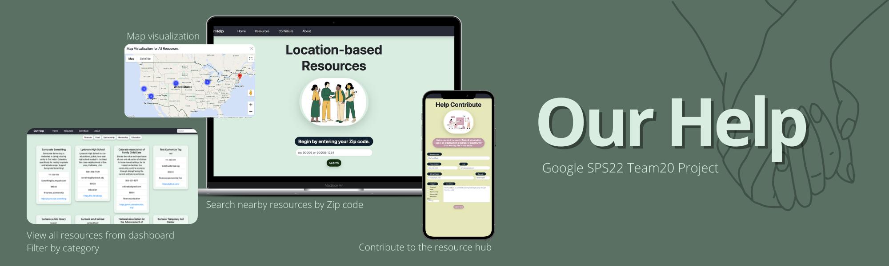

<h1 align="center">
  Google SPS Team 20 - Our Help
  <br/>
  
</h1>

## Background

This is a [Google Software Product Sprint](https://buildyourfuture.withgoogle.com/programs/softwareproductsprint) Summer 2022 Project by Team 20. Our Help is dedicated to providing a platform that helps connect people in need to nearby resources through an easy ZIP Code search. We at Our Help recognize that there are resources that are readily available, but many are not always easy to find. We have built a platform that allows anyone to search for programs, resources, and organizations that help improve quality of life.

## Technologies

This web application is built within Google Cloud Platform, hosted on App Engine. The frontend involves Bootstrap and HTML/CSS/JavaScript. The backend is built with Java (Jetty) and Datastore. Google Maps API is used for location-associated functionalities in the app.

## Team

<ul>
<li><a href="https://github.com/johancc"><b>Johan Cervante</b></a> - Project Advisor</li>
<li><a href="https://github.com/ahollenbaugh"><b>Allie Hollenbaugh</b></a> - Developer (Back-end)</li>
<li><a href="https://github.com/mike39608"><b>Michael Peters</b></a> - Developer (Front-end)</li>
<li><a href="https://github.com/pabdue"><b>Pablo Duenas</b></a> - Developer (Front-end)</li>
<li><a href="https://github.com/zorazrr"><b>Zora Zhang</b></a> - Developer (Back-end)</li>
</ul>

## Usage

The project is live at [https://summer22-sps-20.appspot.com/](https://summer22-sps-20.appspot.com/).

### Running the App

To get started:

- Clone this repo: `git clone https://github.com/johancc/software-product-sprint-2022.git`
- Login to [Google Cloud Shell](https://cloud.google.com/shell)
- Set up `env_variables.yaml` in the root directory with `GOOGLE_MAPS_API_KEY`
- To run a local server, execute this command:

```
mvn package exec:java
```

- To deploy on App Engine, execute this command:

```
mvn package appengine:deploy
```
